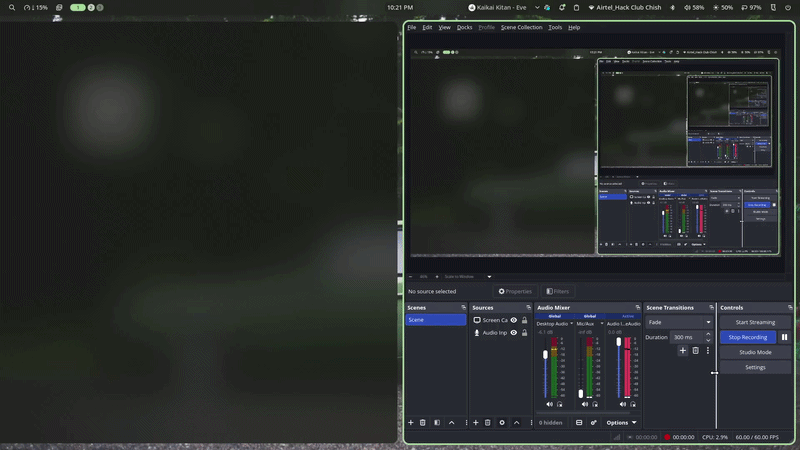

# ELFTUI



A TUI project written in C
This TUI parses the ELF header from the binary, like you can use /usr/bin/ls \n
it can see the info like where the program header table starts, what is the size of each entry, 

## Features

- **Unified Union Architecture:** Uses a custom C `union` to overlay `Elf32_Ehdr` and `Elf64_Ehdr`, executing a single, clean 64-byte read without temporary arrays or file rewinds.
- **Strict Data Separation:** Isolates raw binary data parsing from standard output formatting. The parser populates a clean `Elf_Metadata` domain structure, leaving the UI completely decoupled.
- **Extensive Metadata Extraction:**
  - **Ident Array (`e_ident`):** Class (32 vs 64-bit), Endianness (Little vs Big Endian), Version, OS/ABI (System V, GNU/Linux, FreeBSD, etc.), and ABI Version.
  - **Header Struct:** Object File Type (Executable, Shared Object, Relocatable, Core) and target CPU Architecture (x86-64, ARM, Itanium, SPARC, etc.).

## Getting Started

### Prerequisites

Ensure you have a C compiler and the development libraries for `ncurses` installed on your machine.

On Fedora Linux:
```bash
sudo dnf install gcc make ncurses-devel

Clone the repo and enter it
```bash
git clone https://github.com/chishxd/elftui.git
cd elftui
```

Then compile it!
```
make run
```

## License
MIT baby~~~ [License](LICENSE)
